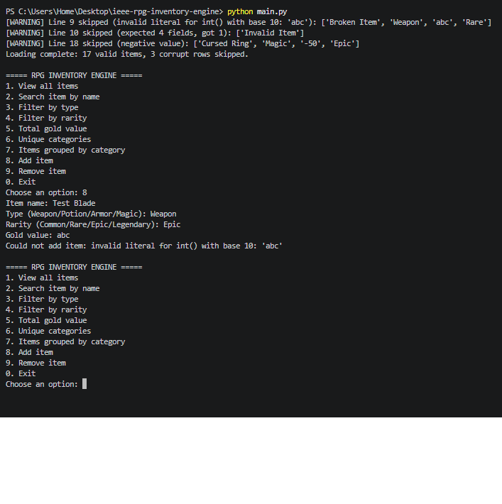
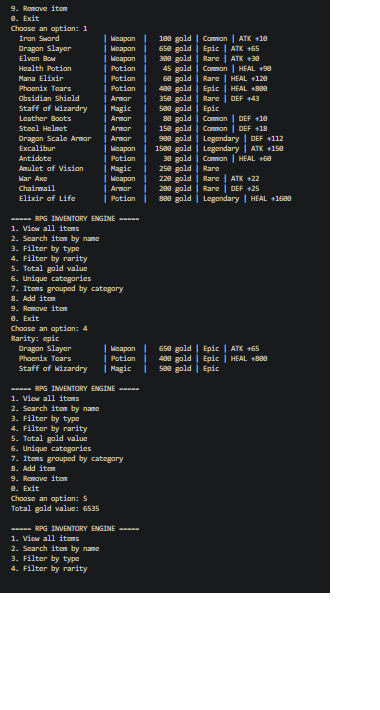

# RPG Inventory Engine

**Week 2: Advanced Python & Data Structures**

**IEEE LGU AI/ML Cohort One**

**AI/ML Leads: Abdullah Faisal & Alina Irshad**

## Project Overview
A game inventory system where a player manages weapons, armor, potions and magic artifacts. Items are loaded from a CSV save file, and corrupted records are detected, reported and skipped without crashing the game.

## Concepts Implemented
- **OOP:** base class `Item` with child classes `Weapon`, `Potion` and `Armor`, method overriding (`describe()`), and an `Inventory` class with encapsulated data
- **File Handling:** items are loaded dynamically from `data/items.csv`
- **Error Handling:** `try / except / finally` while reading the file; corrupt rows are skipped with a warning
- **Data Structures:** list, set (unique categories), nested dictionary (`{"Weapon": [...], "Armor": [...]}`)
- **Comprehensions:** list comprehensions for filtering by name, type and rarity; set comprehension for unique categories

## How to Run
```bash
python main.py
```

## Dataset Information
`data/items.csv` has **20 data rows: 17 valid and 3 corrupt**. The corrupt test cases are:
- `Broken Item,Weapon,abc,Rare` (value is not a number)
- `Invalid Item` (missing fields)
- `Cursed Ring,Magic,-50,Epic` (negative value)

## Execution Screenshots & Proof
**Corrupt rows skipped with warnings, and invalid input handled:**



**Normal run:**

